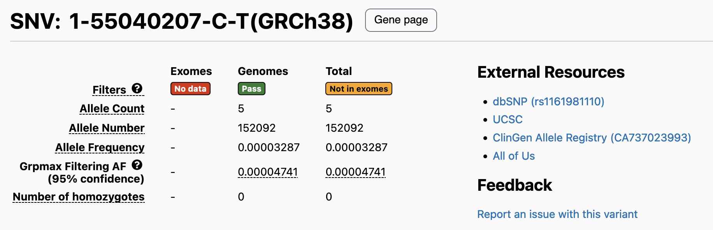
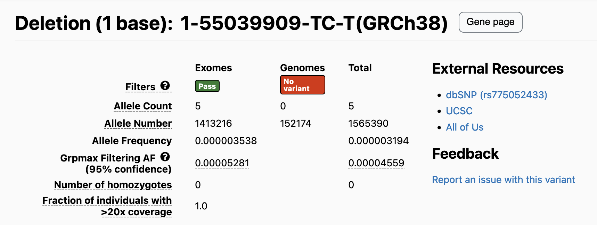
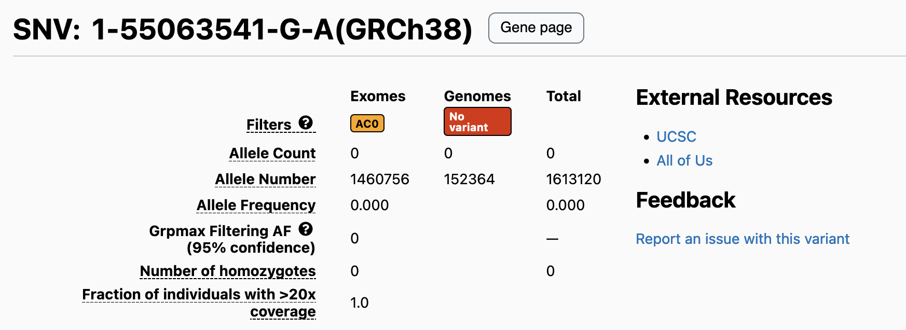

There are three reasons why a variant will have an allele count of 0 or an undefined (missing) allele count (indicated by `-`):

- No data
- No alternate genotype calls
- No high quality genotype calls

### No data
A "No data" flag on a variant page indicates that there were no defined genotypes for samples of that data type. This flag will always appear with either the "Not in exomes" or "Not in genomes" flag. When this flag is present, the allele count of the specified data type will be displayed as `-`.

For example, for this [variant](https://gnomad.broadinstitute.org/variant/1-55040207-C-T?dataset=gnomad_r4), the gnomAD exomes are flagged as having "No data", and the variant is also flagged with the "Not in exomes" flag. This means that no gnomAD exome samples had any defined genotype calls at this site, likely due to this variant being outside of the exome capture regions. For more information about the exome capture technologies within gnomAD v4, see our [help page](https://gnomad.broadinstitute.org/help/exome-capture-tech).

*Screenshot showing a variant flagged with "No data" in the exomes because no exome sample had a defined genotype call at this site.*

### No alternate genotype calls
As part of gnomAD v4.1, we calculated allele number across all callable sites in the gnomAD exomes and genomes. This means that we now display allele number (AN) for both data types if a variant was **called** in either data type and the site was callable in both data types, i.e., we display AN even if there were zero alternate genotype calls in that data type.

For example, this [variant](https://gnomad.broadinstitute.org/variant/1-55039909-TC-T?dataset=gnomad_r4) only has alternate genotype calls in the gnomAD exomes. All of the gnomAD genome samples with defined genotypes at this site had homozygous reference genotype calls. Thus, this variant is flagged as "No variant" in the genomes and an allele count of 0 is displayed.

*Screenshot showing a variant flagged with "No variant" because all samples in that data type had homozygous reference genotype calls.*

### No high quality genotype calls
A variant flagged with the "AC0" [flag](https://gnomad.broadinstitute.org/help/what-do-the-flags-on-the-browser-mean) indicates that the allele count for that variant in the specified data type is 0 after removing low quality genotypes. We filter out genotypes as being low quality according to the following criteria:

- Genotype quality (GQ) < 20
- Depth (DP) < 10 for diploid genotype calls or DP < 5  for haploid genotype calls
- Allele balance < 0.2 for heterozygous genotype calls

For example, this [variant](https://gnomad.broadinstitute.org/variant/1-55063541-G-A?dataset=gnomad_r4) is flagged with the "AC0" flag in the gnomAD exomes. This means that some gnomAD exome samples had alternate genotype calls, but all of the alternate genotype calls were filtered due to their low quality, resulting in an allele count of zero for this variant. Note that the gnomAD genomes are also flagged with "No variant" here because none of the genomes had alternate genotpe calls at this site (see above).

*Screenshot showing a variant flagged with "AC0" because all alternate genotypes had low quality and were filtered.*