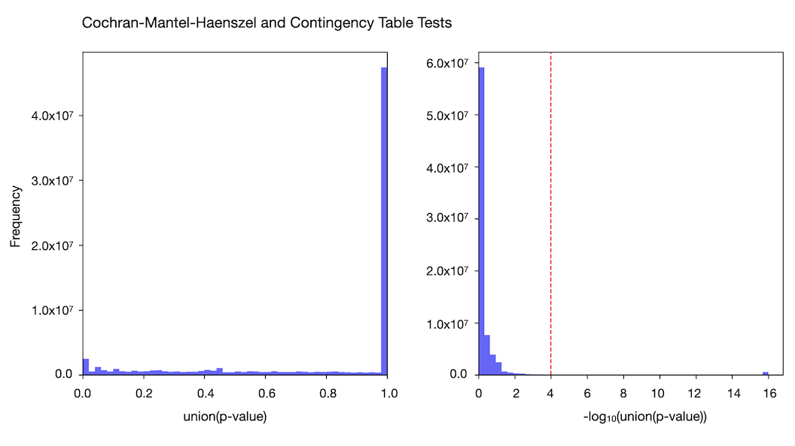

**Contingency Table Test (Chi-squared or Fisher's exact test):**

We applied Hail's [contingency_table_test](https://hail.is/docs/0.2/functions/stats.html#hail.expr.functions.contingency_table_test) to a 2x2 table representing allele counts (AC) and allele numbers (AN) for both exomes and genomes. The minimum cell count in the contingency table defines whether a chi-squared or Fisher's exact test is used. We used a threshold of `min_cell_count=100`, meaning that if all cell counts in the 2x2 table were over 100, we used a Fisher's exact test.  We generated odds ratio and p-values for all variants in both the gnomAD exomes and genomes.

**Cochran–Mantel–Haenszel (CMH) Test:**

This stratified test of independence is applied to 2x2xK contingency tables, where K represents the number of strata (in this case, inferred genetic ancestry groups). The CMH test provides a way to assess variant frequency differences between exomes and genomes while controlling for population structure, offering a more nuanced understanding of the discrepancies observed. The CMH test is computed using the [stats.contingency_tables.StratifiedTable](https://www.statsmodels.org/dev/generated/statsmodels.stats.contingency_tables.StratifiedTable.html) function from [statsmodels](https://www.statsmodels.org/stable/index.html), which outputs a chi-squared test statistic and corresponding p-value. **Note** that we use results from the CMH test and not the contingency table test to flag variants with highly discordant frequencies between the exomes and genomes.

**Variant Warnings Based on CMH Test Results:**

In gnomAD v4.1, we add a warning to variants exhibiting highly discordant frequencies between the exomes and genomes. By leveraging CMH test statistics, we've pinpointed variants where the CMH p-value is less than 10^-4 and have flagged these variants for users' attention. About 4% of variants (2,486,726 out of 57,553,936) exhibit statistically different frequencies between the two data types at this threshold.

The expected number of variants to reach this threshold by chance is 5,800 (out of 58 million total variants shared between the exomes and genomes). Observing approximately 430 times more variants than expected highlights the robustness of our approach. The CMH p-value distribution further supports the validity of our warnings, showing minimal baseline inflation and underscoring the significance of flagged variants.

**Why have we added these statistical tests**

For the first time, in gnomAD v4.0, we released a combined filtering allele frequency (FAF), integrating variant frequencies across the 734,947 exomes and 76,215 genomes. This integration brings the advantage of a larger, more diverse sample set but also introduces challenges. These challenges stem from differences in sequencing and processing methodologies, as well as variations in sample composition due to ascertainment biases. Addressing these challenges is crucial for providing accurate and reliable genetic insights.

These enhancements and warnings are part of our ongoing commitment to data integrity and usability in gnomAD. By identifying variants with significant frequency discrepancies and providing contextual warnings, we aim to equip researchers with the knowledge needed to make informed decisions in their genetic analyses. We encourage users to explore these new statistical analyses as they navigate gnomAD v4.1.

For more information about these flags and how to approach interpreting frequencies at the flagged loci, please see our [blog post](https://gnomad.broadinstitute.org/news/2024-04-gnomad-v4-1).
