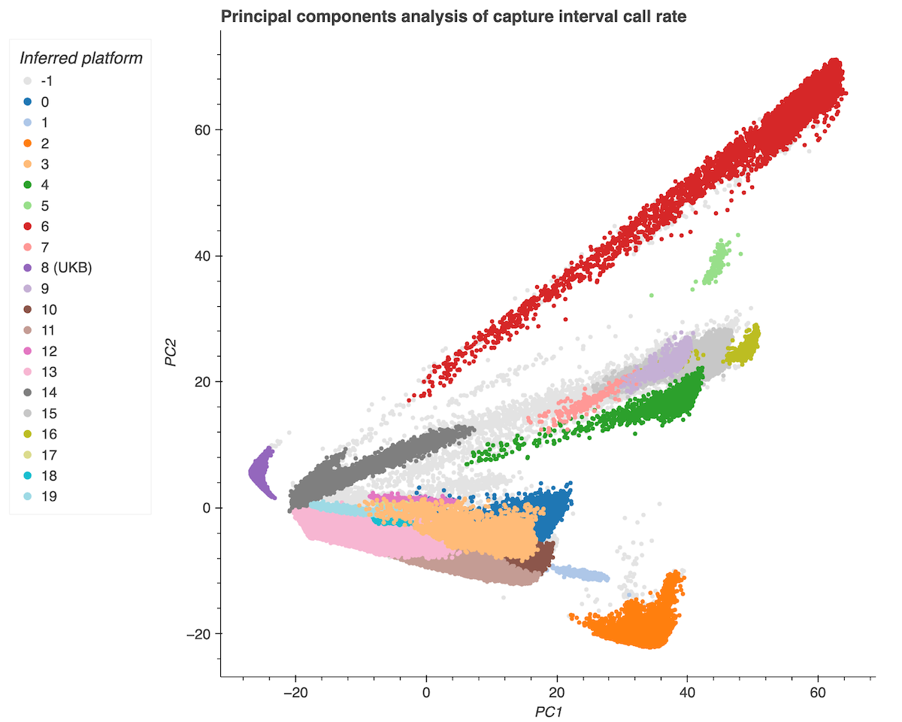

The gnomAD database is composed of samples that have been sequenced over the last two decades at the Broad Institute. During that time, hybrid selection, capture, and sequencing machines and technologies have all changed, resulting in 20 imputed sequencing platforms within the v4 exome dataset. 

*PCA visualization of platform imputation, i.e. the sequencing technologies and software suites used in the gnomAD v4 exome dataset.*

The vast majority of the exome technologies have overlapping probe target regions. However, due to the variability in technologies, specifically the probe target regions, not all samples will have coverage at the same sites. This can lead to variable allele number (AN) counts throughout the exome. Furthermore, there are regions that are unique to a specific technology and the calling intervals used, which means that only samples processed with those technologies will have coverage and AN in those regions. This phenomenon is most obvious when considering that over half of the v4 exomes, the UK Biobank exomes (n=416,555), used a single technology for capture (Integrated DNA Technologies’ xGen Exome Research Panel). The other exomes in v4 used a variety of technologies, including Agilent SureSelect, Illumina’s Nextera, TWIST biosciences, and other unknown technologies. Smaller coverage differences can also be attributed to reagents within each technology, e.g. differences in capture blocker reagent lots. We encourage our users to check the region flags in our [allele number downloadable files](<replace-when-link-exists) to determine whether a significantly lower than expected AN can be attributed to capture technology.
