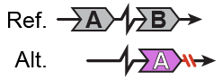

##  Insertions with insertion-site deletions (INS-iDEL)  

Classification: _unbalanced complex SV_

  

Insertions with insertion-site deletions are complex SVs involving an insertion with a deletion at the site of insertion.  
