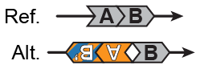
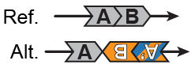

##  Duplication-flanked inversions (dupINV & INVdup)  

Classification: _unbalanced complex SV_

#### Configuration A (dupINV)

  

#### Configuration B (INVdup)  

  

Duplication-flanked inversions are complex SVs involving an inversion with a duplication at either the 5' or 3' breakpoint. When the duplication occurs at the 5' breakpoint, the SV is labeled as `dupINV`; in the case of 3' duplications, the SV is labeled as `INVdup`. The two configurations of duplication-flanked inversion, `dupINV` and `INVdup`, are molecularly indistinguishable, but are differentiated in gnomAD for the purposes of interpreting which side of the inversion is duplicated relative to the reference genome assembly.  
