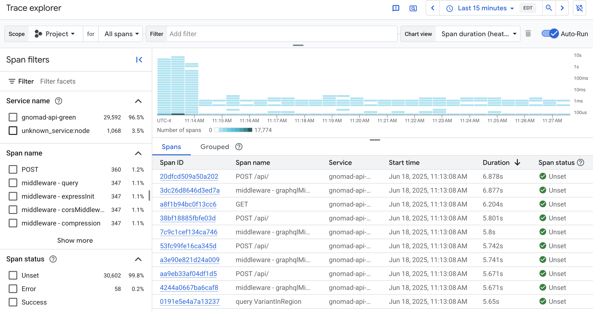
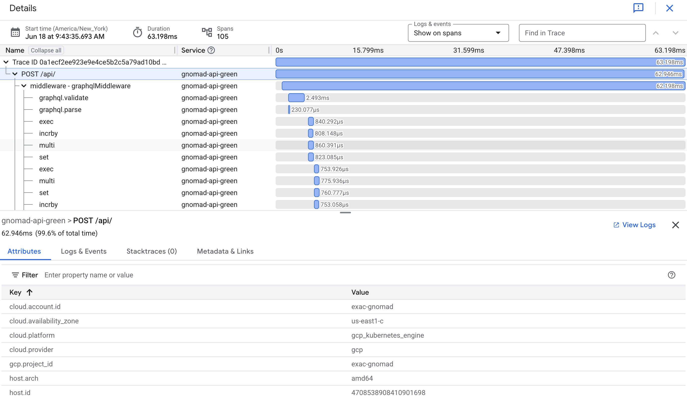

The gnomAD API incorporates [OpenTelemetry](https://opentelemetry.io) tracing, to help us understand the root causes of performance problems. Profiling data is captured live as the API is running, and ultimately ends up in GCP's [Trace Explorer](https://console.cloud.google.com/traces/explorer) for our review.

# Spans and traces

[**Spans**](https://opentelemetry.io/docs/concepts/signals/traces/#spans) are the basic unit of information in OpenTelemetry, each representing "a unit of work or operation" done by the system.

Spans are grouped hierarchically into trees called [**traces**](https://opentelemetry.io/docs/concepts/signals/traces/). For instance, we might have a span as the root of a trace representing the entirety of work done for a single API request. That root span could have spans under it representing respectively parsing of the query body, cache lookup, ElasticSearch queries, and all the other subtasks that go into fulfilling an API request. Each of those subtasks might be subdivided further. Spans can also have metadata attached to them: what metadata is attached is context-dependent.

# Using the Trace Explorer

This is the main interface for the Trace Explorer:

## Span heatmap

By default, the overview of spans are visualized by the heatmap in the upper-right corner, which shows a breakdown of spans in a given duration bucket over time. The darker the cell in that heatmap, the more spans in that bucket came in during that time period. Note that the Y-axis, denoting duration, is on a logarithmic scale with a base of 10; that is, every cell represents a duration bucket an order of magnitude greater than the cell below it.

Clicking a cell in the heatmap filters the list of spans below the chart to the corresponding time and duration bucket.

## Other span overviews

By setting "Chart view" you can also switch to a visualization showing spans received per second, or span duration at varied percentiles (99th, 95th, 90th, and 50th).

## Viewing a trace

By clicking a span in the list below, we can see the trace it's part of. Here's a typical trace for an API query:

Each line of this diagram represents a single span in the trace, with child spans nested within their parents. Note how the topmost line has a blue bar representing the full duration of the trace, whereas the bars corresponding to the child spans show only the part of the full duration during which that span was active.

# What is instrumented

Currently we're only using the automatic instrumentation made available by [the `@opentelemetry/sdk-node` package](https://www.npmjs.com/package/@opentelemetry/sdk-node), specifically, the `getNodeAutoInstrumentations` function. This instruments a number of the most popular Node packages and core libraries. Libraries which we use that are covered by automatic instrumentation include:

- Express
- GraphQL
- ioredis
- http
- net
- DNS

We will probably want to add manual instrumentation as well once we've identified some hot spots: see [the `opentelemetry-js` examples](https://github.com/open-telemetry/opentelemetry-js/tree/main/examples).

# Infrastructure

Our setup runs one [OpenTelemetry collector](https://opentelemetry.io/docs/collector/) as a [gateway](https://opentelemetry.io/docs/collector/deployment/gateway/) per API deployment, which serves as a middleman between our API pods and Trace Explorer.

For a deployment called `foo`, the corresponding collector deployment is called `opentelemetry-collector-foo`. It exposes one service on port 4318, for accepting traces from API deployments. The correct URL for this is available to the API via the `OPENTELEMETRY_COLLECTOR_URL` environment variable.

The full configuration for the collector is in [`opentelemetry.service.yaml`](./deploy/manifests/browser/base/opentelemetry.service.yaml).
