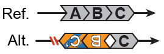

##  Paired-CNV inversions (delINVdup & dupINVdel)  

Classification: _unbalanced complex SV_

#### Configuration A (delINVdup)

  

#### Configuration B (dupINVdel)  

  

CNV-flanked inversions are complex SVs involving an inversion with a duplication at one breakpoint and a deletion at the other breakpoint.  When the deletion occurs at the 5' breakpoint and the duplication at the 3' breakpoint, the SV is labeled as `delINVdup`. In the case of a 3' deletion and 5' duplication, the SV is labeled as `dupINVdel`. The two configurations are molecularly indistinguishable, but are differentiated in gnomAD for the purposes of interpreting which side of the inversion is deleted and duplicated relative to the reference genome assembly.  
