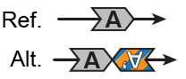

##  Palindromic inverted duplications (piDUP-FR & piDUP-RF)  

#### Configuration A (piDUP-FR)

  

#### Configuration B (piDUP-RF)  

  

Palindromic inverted duplications are complex SVs involving the simultaneous duplication and inversion of at least 1kb of genomic sequence. In gnomAD, we specify two configurations, depending on the orientation of the duplicated copy relative to the reference copy: 
  - `piDUP-FR` if the reference (unduplicated) copy comes before the duplicated copy (i.e., head-to-head orientation)
  - `piDUP-RF` if the duplicated copy comes before the reference copy (i.e., tail-to-tail orientation)
