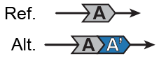

##  Duplications (DUP)  

Classification: _Unbalanced canonical SV_

  

Duplications are SVs that involve the creation of an additional copy of at least 50bp of genomic DNA, relative to the reference genome assembly under the assumption that all loci in the reference are diploid (or haploid in the case of sex chromosomes in XY individuals).  

In gnomAD, all duplications with evidence from anomalous paired-end reads or split reads are confirmed to be direct tandem duplications. This evidence is indicated on the variant page and in the `EVIDENCE` field of the VCF. Duplications absent this evidence are not guaranteed to be in direct tandem orientation; however, most duplications are thought to occur in tandem (e.g., see [Newman et al., 2015](https://www.ncbi.nlm.nih.gov/pubmed/25640679) or [Brand et al., 2015](https://www.ncbi.nlm.nih.gov/pubmed/26094575)).  
